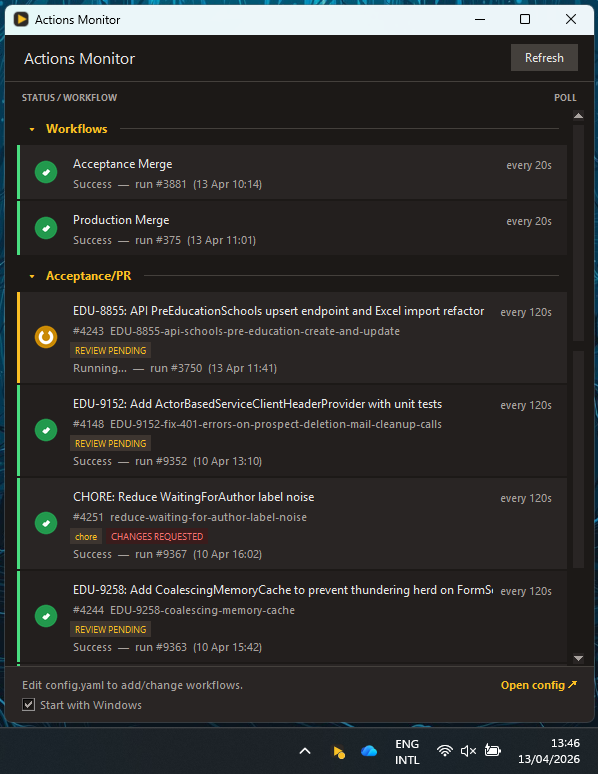
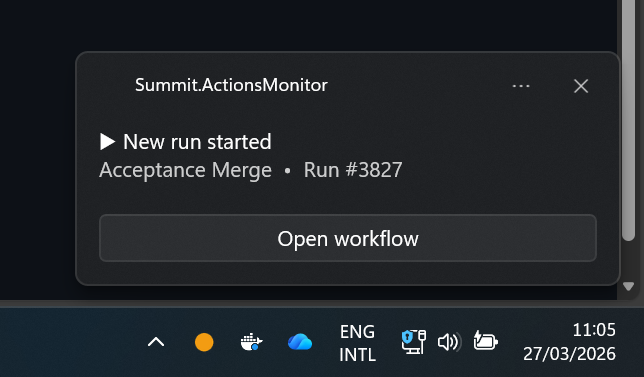

# Actions Monitor

A lightweight Windows tray application that monitors GitHub Actions workflow statuses and notifies you when something changes.



## [Changelog](CHANGELOG.md)

## Features

- **Live status** — polls your configured workflows and shows green / orange / red status indicators
- **PR mode** — monitor your own pull request builds: one row per active PR, with branch prefix tags, PR numbers, target branch indicators, and a DRAFT indicator. When a branch has multiple PRs (e.g. hotfix → acceptance and hotfix → production), each PR gets its own row. Stale rows auto-remove after a configurable timeout
- **System tray** — minimises to tray; tray icon colour reflects the worst combined state across all workflows

  
- **Toast notifications** — notified when a run starts, succeeds, or fails, with an **Open workflow** button that takes you straight to the run
- **Per-workflow config** — different polling rates, branch filters, and notification overrides per workflow
- **Hot-reload** — edit `config.yaml` and the app picks up changes within seconds, no restart needed
- **Start with Windows** — toggle in the app footer; writes a registry entry for the current user (no admin required)

## Requirements

- Windows 10 / 11 (Linux works too, without the toast button feature)

## Getting started

1. Run `ActionsMonitor.exe` — on first launch it creates `config.yaml` from the template
2. Add your GitHub token and workflows (see [Configuration](#configuration) below)
3. The app hot-reloads the config, no restart needed

### Development setup

If you want to run from source instead of the exe:

```
src\dev-install.bat
```

Installs Python dependencies and creates `config.yaml` from the template.

### Building the `.exe` from source

Requires Python 3.10+ with dependencies installed (`pip install -r src/requirements.txt`).

```
src\build.bat
```

Produces `ActionsMonitor.exe` in the project root.

## Configuration

Open `config.yaml` (or click **Open config ↗** in the app footer). The file is heavily commented — the key things to fill in are:

### GitHub token

Required for private repositories. Without one the API returns a 404.

Use a **classic token** (fine-grained tokens require org admin approval):

1. Go to [github.com/settings/tokens](https://github.com/settings/tokens)
2. Click **Generate new token (classic)**
3. Enable the top-level **`repo`** scope
4. Paste the token into `config.yaml`

```yaml
github_token: "ghp_xxxxxxxxxxxxxxxxxxxx"
```

> **Note:** Classic tokens have no dedicated "read Actions" scope — the Actions API for private repos falls under the broad `repo` scope. The token still only acts on behalf of your own account.

### Adding workflows

There are three modes: **branch mode** (default) monitors a specific workflow+branch combo, **PR mode** monitors your own pull request builds, and **actor mode** shows all your recent runs across a repo.

#### Branch mode

Paste the workflow URL straight from your browser:

```yaml
workflows:
  - url: https://github.com/your-org/your-repo/actions/workflows/ci.yml
    name: "CI"
    polling_rate: 30

  - url: https://github.com/your-org/your-repo/actions/workflows/deploy.yml?query=branch%3Amain
    name: "Deploy (main)"
    polling_rate: 60
```

Branch filters are extracted automatically from the URL query string, or you can set them explicitly:

```yaml
  - url: https://github.com/your-org/your-repo/actions/workflows/ci.yml
    branch: main
```

#### PR mode

Set `mode: "pr"` to see one row per active PR you authored. Your GitHub username is auto-detected from the token — no extra config needed.

```yaml
  - url: https://github.com/your-org/your-repo/actions/workflows/ci.yml
    name: "CI — My PRs"
    mode: "pr"
    polling_rate: 45
    max_prs: 5             # max PR rows to show (default: 5)
    pr_stale_after: "5m"   # duration before removing a stale row (default: "5m")
```

PR rows show:
- Branch prefix tags (e.g. `hotfix`, `feature`, `chore`) parsed from the branch name
- PR number, cleaned branch name, and target branch (e.g. `#42 fix-123 → acceptance`)
- A **DRAFT** badge when the PR is a draft
- A colour-escalating **STALE** badge (yellow → orange → red) based on how long since the PR was last updated
- Review status badges: **APPROVED**, **CHANGES REQUESTED**, or **REVIEW PENDING**
- When a branch has multiple PRs targeting different branches, each PR appears as a separate row

#### Staleness thresholds

Global config that controls when the STALE badge appears on PR rows. Accepts human-friendly durations (`"30m"`, `"12h"`, `"1d"`, `"2d12h"`):

```yaml
staleness_thresholds:
  slightly_stale: "1d"      # yellow badge after 1 day
  moderately_stale: "3d"    # orange badge after 3 days
  very_stale: "5d"          # red badge after 5 days
```

### Notifications

Global defaults, with optional per-workflow overrides:

```yaml
notifications:
  new_run:
    enabled: true
    sound: default       # "default", "none", or path to a .wav file
  failure:
    enabled: true
    sound: default
  success:
    enabled: true
    sound: none
```

## Status colours

| Colour | Meaning |
|--------|---------|
| 🟢 Green | Last run succeeded |
| 🟠 Orange | Run in progress or queued |
| 🔴 Red | Last run failed |
| ⚫ Grey | Unknown / no runs found |

The tray icon follows the same logic, showing the worst state across all configured workflows.

## Uninstall

Disable **Start with Windows** in the app footer, then delete the folder.

If you used the development setup, run `src\dev-uninstall.bat` to also remove the startup registry entry and Python packages.

## Updating

The app checks for updates automatically on startup (when running from source). If a new version is available, a dialog offers to pull and restart for you.

For the exe, download the latest `ActionsMonitor.exe` and replace the old one.

